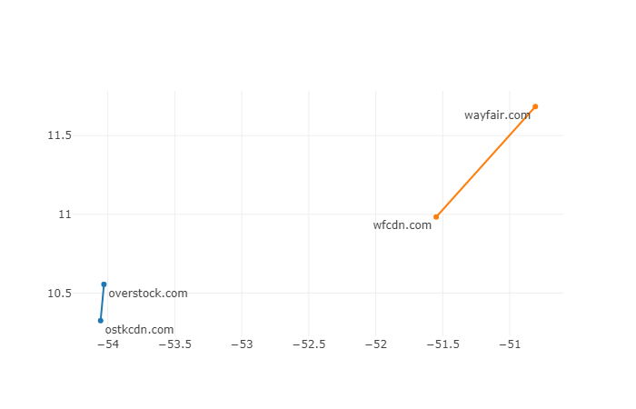

# Introduction
An ISP is always interested in understanding how to better prioritize, shape or even filter traffic if needed. However, with the ubiquitous use of HTTPS and other encrypted protocols this has become much harder. Vector embeddings for domain names would encode similarity between web pages and once available for a large corpus of domain names it can very quickly be used map web traffic to a category (shopping, entertainment, news/media etc.) and enable a whole set of other traffic engineering applications. Our approach, Dns2Vec, is Word2Vec applied to DNS traffic by considering DNS queries from a particular source IP address in a time interval as “words” in a single “document”. The Word2Vec model uses a single hidden layer neural net to learn word embeddings. The Skipgram variant of the Word2Vec model is used here as we want to predict the target word (similar domain name) given another word (input domain name).


# Related Work
There are several COTS solutions for finding similar domains such as SimilarWeb, Web Shrinker  and Alexa Sites. A 2017 paper by Opez et.al.[1], discusses the idea of word embeddings for domain names. Dns2Vec while having the same core idea uses different approaches for pruning the dataset, a different set of hyperparameters that work better for our dataset and evaluating the effectiveness of embeddings by using web site categorization rather than direct similarity as that is better suited for traffic engineering applications. A 2018 paper by Dupré et.al.[2] discusses hyperparameter choices for applying Word2Vec for non-NLP data, we use that as a reference for discovering hyperparameters that work best for our dataset.

# Datasets

DNS query traffic was collected from a large ISP for a 3 day period. The dataset consisted of CSV files (one for each day) in the format _timestamp,IP version,Source IP address,Query Name,Query Type_. The files were combined into a single file which had a total of 589 million rows (one DNS query per row) and provided to a data cleaning and wrangling module which removed all queries except A and AAAA type queries that correspond to a host IP address lookup and are therefore queries that we are interested in. Another dataset which provided ccTLD (country code  top level domain) was used to help identify domain names such as yelp.com.de which end a country specific suffix.

To remove the heterogeneity from domain names belonging to the same entity  the domains were shortened to 2 or 3 significant levels (only for domains ending in country specific suffixes) resulting in 1.05 million unique domains. For example images.mydomain.com and music.mydomain.com were both reduced to mydomain.com, while images.mydomain.com.us was reduced to mydomain.com.us to preserve the country specific nature of the domain name.

The file was parsed, each line tokenized and  a new timestamp aggregation field was created to group timestamps into 20 minute intervals. The IP address assigned to a user is generally dynamic and could change with the course of time (for example after an extended inactivity period). Therefore a time interval had to be choosen which was short enough to ensure that the IP address assigned to a user did not change during that period and at the same time long enough to accumulate a critical mass of domain name queries. 20 minutes offered a good middle ground, other values that were experimented with were 1 hour and 1 day. The _$T_{interval}$,Source IP address_ tuple was used as a grouping key to create a Documents of DNS queries. The structure of a single document that corresponded to 20 minutes worth of DNS lookups from a single IP address was of the form _$T_{interval}$, Source IP address, [dn1, dn2, ..,dnN]_.  The entire dataset was converted into a corpus of DNS documents in this way.

Before this corpus of DNS documents could be fed to a Word2Vec implementation, there is another data cleaning step that needed to be done and that was the removal of "stop-domains". Stop-domains akin to stop-words are domain names such as google.com, facebook.com etc. that occur frequently in every document and thus make it difficult to get good quality embeddings since they would appear to be similar to a lot of domain names. To identify stop-domains a TF-IDF[8] score was determined for each domain name and the 100 domain names with the lowest TF-IDF scores were treated as stop-domains, these included google.com, apple.com etc. This method, although similar to, but is better than a pure frequency based approach since it takes into account occurrence of these domain names across documents. See Figure 1 for a pure frequency based approach which provides similar results and Table 1 (full listing [here](https://raw.githubusercontent.com/aarora79/dns2vec/master/paper/results/fqdn_tfidf_subset.csv "here")) for domain names with the 100 smallest TF-IDF values.

```{r echo=F, out.width="4in", fig.cap="Query count by top level entity"}

```

```{r echo=F}
suppressMessages(library(kableExtra))
suppressMessages(suppressWarnings(library(dplyr)))
suppressMessages(suppressWarnings(library(tidyverse)))
df <- suppressMessages(read_csv("https://raw.githubusercontent.com/aarora79/dns2vec/master/paper/results/fqdn_tfidf_subset.csv"))
kable(df %>% tail (10),
      col.names = c("Domain name", "TF-IDF"), caption = "Domain names with lowest TF-IDF values")
```


# Methods

The python library called Gensim was used for the core Word2Vec implementation. The entire code that we wrote for the Dns2Vec implementation is in Python 3, this does not include the Word2Vec implementation for which we used the Gensim package. The data cleaning and Word2Vec programs were run on a Amazon EC2 m5.x12large virtual machine with 100 GB SSD, 42 CPUs and 192GB RAM running Redhat 7 operating system. 

The corpus of DNS documents after data cleaning as described above was fed to the Gensim package’s Word2Vec implementation (Figure 2). Several experiments were run with different sets of hyperparameter for the Word2Vec model. The best set of hyper parameters were: vocabulary size 40,000, downsampling threshold $10^{-5}$, negative exponent -1, embedding size 128, window 7, negative samples 5 and training iterations 150. It took about an hour to clean the data and train the Word2Vec model on the DNS documents with this set of hyper parameters on the m5.x12large EC2 instance. The data cleaning was run as a Python multiprocessing program. Gensim's Word2Vec implementation's parameter for number of worker threads was set to 42 (equal to number of CPU cores) to make the training process massively parallel. Figure 3 shows the training loss delta per epoch, the training loss delta decreases drastically till epoch 80 and after that the decrease is very marginal. See [this link](https://stackoverflow.com/questions/52038651/loss-does-not-decrease-during-training-word2vec-gensim "this link") for discussion on why training loss delta is choosen as a metric rather than the training loss itself.

```{r echo=F, out.width="4in", fig.cap="Dns2Vec: neural net architecture"}

```

```{r echo=F, out.width="4in", fig.cap="Training loss delta"}

```


The results obtained were DNS vectors and were evaluated for each set of hyperparameters using two approaches. 

1. For a given set of 10 domain names (choosen from various categories like news/media, business etc) find out a set of 10 similar domains and manually compare (by visiting the websites) how many of the 10 similar domains appeared to be similar to the input domain. The set of hyper parameters for which the number of similar domains that looked good on a manual comparison was larger was considered to be the better model. Similar domains were found using a Gensim function which in turn uses cosine similarity for evaluating vector similarity.

2. Find out category of each of the domain name in the vocabulary, where a category is defined as news/media, technology, business etc. Then find out the category for the 3 most similar domains. If at least one of the similar domains happens to be in the same category as the input domain then treat that as a match. Repeat this process for all domains in the vocabulary and finally determine the fraction of domains for which the match evaluates to true i.e. fraction of domains for which the domain and at least one of the three most similar domains fall in the same category. To determine the category an online service called Symantic K9 ([link](http://www1.k9webprotection.com/get-k9-web-protection-free "link")) was used, this is a free service which provides a REST API based interface for determining the category of a website.

Once the best set of DNS vectors were obtained using the hyper parameters mentioned above, a t-SNE visualization of the vectors was prepared to determine if domain names belonging to the same category cluster together i.e. do all search engines cluster together, news/media web sites cluster together and so on and so forth. 

Another aspect that was explored was to build a network topology by taking a domain name as a seed, link it to its three closest domain names and then keep on repeating the process to build a network graph. Such a graph could then be used as a source dataset for applying graph analytics to determine which nodes (domain names) have the highest connecitvity and betweeness measures.

# Results

Table 2 shows similar domains determined using Dns2Vec for a sample of input domains, a complete listing is available ([here](https://raw.githubusercontent.com/aarora79/dns2vec/master/paper/results/similiar_domains_from_nb.csv "here")):

```{r echo=F}
suppressMessages(library(kableExtra))
kable(data.frame(d=c("elle.com", "", "", "", "webmd.com", "", "", "", "", "", "", "match.com", "", "", "", "", "",
                     "glassdoor.com", "", "", "", "",
                     "54.207", "", "food.com", "", "", "", "", "", "", "walmart.com", "", "", "", "", "", "uber.com", "", "", "", "", "newmexico.gov","", "", "", "", ""), sd=c("getpocket.com, economist.com, hbr.org",
                                       "nextadvisor.com, theatlantic.com",
                                       "theringer.com, newyorker.com, wired.com",
                                       "vox.com, mozilla.net",
                                       "honcode.ch, tagsrvcs.com, surveywriter.net",
                                       "ibclick.stream, medscape.com",
                                       "medicinenet.com, healthline.com",
                                       "medscapestatic.com, sfvwe.com",
                                       "emedicinehealth.com, mayoclinic.org",
                                       "everydayhealth.com, rxlist.com",
                                       "medicalnewstoday.com, agoramedia.com",
                                       "peoplemedia.com, hexagon-analytics.com", 
                                       "ourtime.com, siftscience.com",
                                       "blackpeoplemeet.com, zoosk.com, pof.com",
                                       "okccdn.com,chowhound.com, gotinder.com",
                                       "birchlane.com, tindersparks.com",
                                       "ibmlivenationapi.com, wdrimg.com",
                                       "ziprecruiter.com, indeed.com, glassdoor.de",
                                       "filter.to, appcast.io, careerbuilder.com", 
                                       "jobcase.com, jobs2careers.com, milwpc.com", 
                                       "myjobhelper.com, talentbrew.com, j2c.com", 
                                       "uber.com, snagajob.com, dominos.com",
                                       "207.14, 254.207, 207.79, 42.168",
                                       "207.22, 20.65, 15.128, 75.179",
                                       "geniuskitchen.com, whisk.com",
"snidigital.com, foodnetwork.com",
"sndimg.com, addapinch.com",
"mediavine.com, ahalogy.com",
"filestackapi.com, sni-dat.com",
"adthrive.com, tastykitchen.com",
"allrecipes.com, unicornengine.net", "wal.co, walmartimages.com, wmt.co",
"hlserve.com, radar.io, schema.org", "lowes.com, wayfair.com", "target.com, samsclub.com", "webcollage.net, chatidcdn.com", "myvisualiq.net, bestbuy.com",
"ubr.to, bttn.io, adj.st", "bnc.lt, test-app.link, fb.gg", "m.me, ig.me, onelink.me", "amazon.it, app.link, amazon.es", "linkedinmobileapp.com, etsy.me, lyft.com",
"medicare.gov, 62.138, renlearn.com", "dot.gov, us.local, azdot.gov", "activistpost.com, inspcloud.com", "117.43, jeffcopublicschools.org", "nm.us, premierboneandjoint.com, 94.123", "vitalsite.com, 254.113"
                                       )),  format = "latex", col.names = c("Domain", 'Similar Domains'), caption = "Similar domains using Dns2Vec", escape = F) 

```

```{r echo=F}
suppressMessages(library(kableExtra))
kable(data.frame(a=c("wfcdn.com - wayfair.com + overstock.com = ovstkcdn.com\\\\(find CDN for a website)",
                     "delta.com + hilton.com = tripadvisor.com\\\\(hotel and taxi combine to form a trip)")),
                 format = "latex", 
      col.names = c("Analogy discovered by Dns2Vec"), caption ="DNS Analogies", escape = F)
```

We also experimented with building Word2Vec style DNS analogies, see Table 3 and Figure 6. 

```{r echo=F, out.width="4in", fig.cap="Network Topology with wellsfargo.com as seed"}
knitr::include_graphics("./figures/network_topology.png")
```

All 40,000 domain names in the vocabulary were grouped into categories such as shopping, news/media, sports, adult etc. using Symantec K9 website categorization service. After finding top 3 most similar domains corresponding to a given name and then considering the result to be valid if at least one of the top 3 domains is in the same category as the input domain a success metric was calculated. The success metric evaluated over the entire Dns2Vec vocabulary was found to be 55.4%. The vectors corresponding to the domain name were plotted in 2-dimensional space using t-SNE and were color coded by category. Domains belonging to the same category tend to cluster together, this is especially true for search engines, uncategorized/suspicious, adult content and news/media. Refer to Figure 5, a better quality picture is available ([here](https://raw.githubusercontent.com/aarora79/dns2vec/master/paper/figures/tsne.png "here")).

```{r echo=F, out.width="4in", fig.cap="t-SNE for DNS vectors"}

```

Finally, a network topology built using __wellsfargo.com__ as a starting domain is presented in Figure 6. The network topology discovered by recursively discovered three most similar domains reveals interesting patterns which not only include other similar websites (chase.com) but also domains in different categories such as website security (verisign.com) and hosting (godaddy.com). Refer to Figure 4, a better quality picture is available ([here](https://raw.githubusercontent.com/aarora79/dns2vec/master/paper/figures/network_topology.PNG "here").

```{r echo=F, out.width="4in", fig.cap="Domain name relations via Dns2Vec"}

```

# Discussion of Results

We show that vector embeddings can be used for representing domain names and the DNS vectors do encode similarity between domains (Table 1, Figure 4). We also show that vector arithmetic is able to find complex relations between domains that corresponds to real world linkages (Table 2, Figure 5). Furthermore, the domain name vector space can be traversed to build network topologies (Figure 6). All this has tremendous value to various traffic engineering functions because now just using the vector representation of a domain name the traffic corresponding to it can be categorized (news/media, shopping or any other custom defined category) and once categorized this traffic can be easily prioritized, shaped, filtered or even be used to determine an average vector for a browsing session.


#  Conclusions

We have shown that good vector representation of domain names can be derived by doing Word2Vec on sequence of domain names grouped by time interval and source IP address. The domain name vectors can be used for finding other similar domains and building complex analogies without having any other information such as the content of the web page hosted by these domains. 

Future work in this area would be to explore further hyperparameter optimization to get better embedding efficiency and separation in t-SNE representation. Also, collecting more data would certainly produce even better quality vectors.  An alternative to using DNS logs could be to use IP flow logs corresponding to actual traffic flows, this would present yelp.com and yelp.de from appearing as similar domains which would help with traffic prediction applications. Another potential area is use of DNS vectors in a sequence-to-sequence model which consumes a sequence of domain name vectors to predict a sequence of domain names that would be accessed next which can then be prefetched before actually being requested thus improving web page loading times.

\pagebreak

# References

1. Waldemar Lopez, Jorge Merlino and Pablo Rodrıguez-Bocca. 2017. Vector representation of Internet Domain Names using a Word Embedding technique.
2. Hugo Caselles-Dupré, Florian Lesaint, Jimena Royo-Letelier. 2018. Word2vec applied to Recommendation: Hyperparameters Matter. arXiv:1804.04212v3 [cs.IR].
3. Quoc V. Le and Tomas Mikolov. 2014. Distributed representations of sentences and documents. CoRR, vol. abs/1405.4053.
4. Ben Eisner, Tim Rocktaschel, Isabelle Augenstein, Matko Bosnjak, and Sebastian Riedel. 2016. emoji2vec: Learning emoji representations from their description, CoRR, ol. abs/1609.08359.
5. Tomas Mikolov, Kai Chen, Greg Corrado, and Jeffrey Dean. 2013. Efficient estimation of word representations in vector space, CoRR, vol. abs/1301.3781.
6. Ledell Wu, Adam Fisch, Sumit Chopra, Keith Adams, Antoine Bordes, Jason Weston. 2017. StarSpace: Embed All The Things!. arXiv:1709.03856 [cs.CL] 
7. Andrej Karpathy. 2015. The Unreasonable Effectiveness of Recurrent Neural Networks, http://karpathy.github.io/2015/05/21/rnn-effectiveness/.

# Links to this paper's material

1. Github repo: https://github.com/aarora79/dns2vec
2. tf-idf table: https://raw.githubusercontent.com/aarora79/dns2vec/master/paper/results/fqdn_tfidf_subset.csv
3. Similar domains: https://raw.githubusercontent.com/aarora79/dns2vec/master/paper/results/similiar_domains_from_nb.csv
4. t-SNE:https://raw.githubusercontent.com/aarora79/dns2vec/master/paper/figures/tsne.png
5. Network topology: https://raw.githubusercontent.com/aarora79/dns2vec/master/paper/figures/network_topology.png

